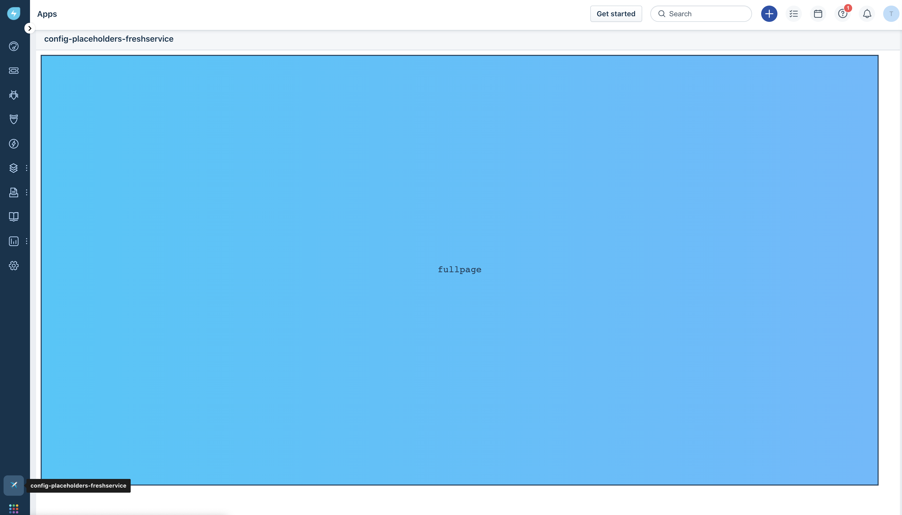
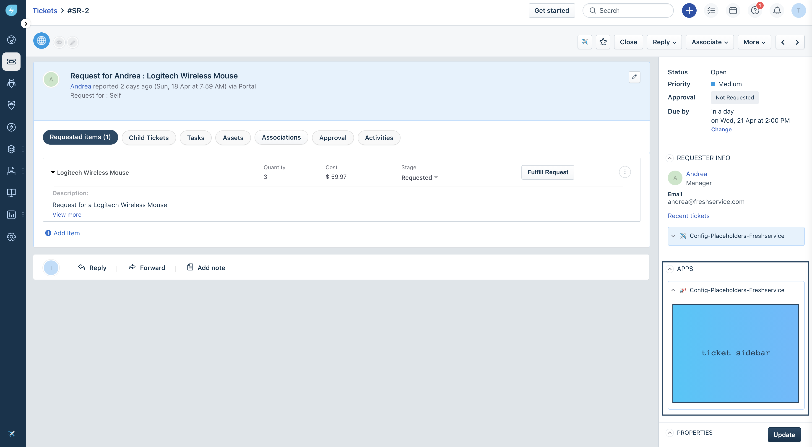
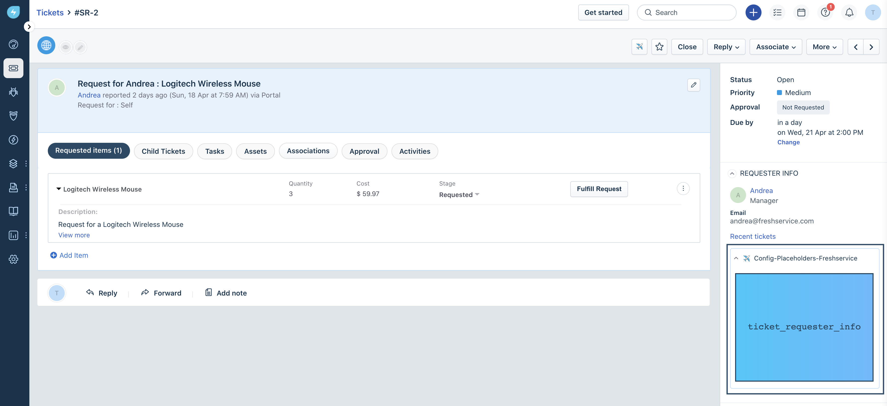
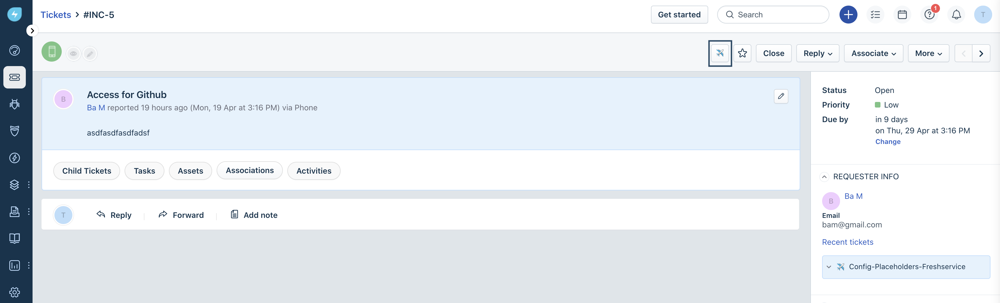

# Freshdesk App Placeholders

## Description:

App on Freshworks developer platform can be located in different placeholders. Some of them render with UI, without UI or simply serverless. This app contains the sample code that is all available for apps those run on browser in-product experience.

## Screenshots:

### Global Navigation Pane
##### `full_page_app`  - The app icon is displayed on the left navigation pane and when clicked, the app page occupies the entire viewport.

### Ticket Details Page
##### `ticket_sidebar` - The app is displayed in the right sidebar on the Ticket Details page and is loaded only after you click the app icon.

##### `ticket_requester_info` - The app is displayed on the Requester Details tab and is loaded only after you click the app icon.

##### `ticket_top_navigation` - The app is displayed on the top navigation bar on the Ticket Details page and is loaded only after you click the app icon.

### Change Details Page

